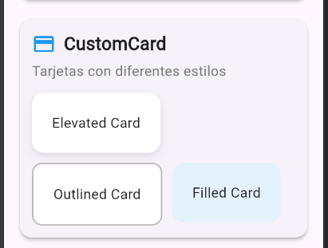
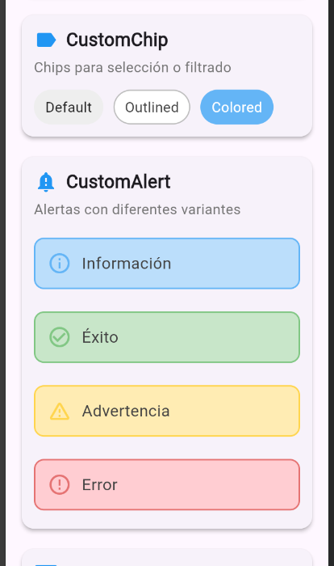
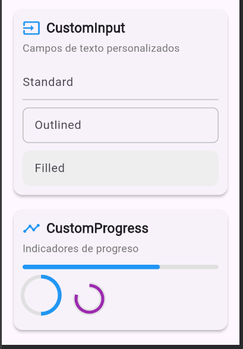

Víctor Barrera Ocampo
I20223tn008

Descripción:
* Este proyecto es una galería de componentes personalizados desarrollados en **Flutter**, pensada para demostrar y probar diferentes widgets reutilizables con múltiples variantes. Cada componente está diseñado para ser modular y fácil de integrar en cualquier aplicación Flutter, usando únicamente las dependencias básicas (`flutter` y `cupertino_icons`).

Componentes:

| #  | Componente      | Variantes                                | Descripción                              |
|----|-----------------|-----------------------------------------|------------------------------------------|
| 1  | CustomButton    | Primary, Secondary, Outlined            | Botones personalizados con distintos estilos |
| 2  | CustomCard      | Elevated, Outlined, Filled              | Tarjetas contenedoras con bordes y sombras |
| 3  | CustomAvatar    | Circular, Rounded, Square               | Avatares con diferentes formas y estilos |
| 4  | CustomBadge     | Info, Success, Warning, Error           | Etiquetas pequeñas de estado o información |
| 5  | CustomChip      | Default, Outlined, Colored              | Chips para selección o filtrado          |
| 6  | CustomAlert     | Info, Success, Warning, Error           | Alertas/mensajes informativos            |
| 7  | CustomInput     | Standard, Outlined, Filled              | Campos de entrada de texto personalizados |
| 8  | CustomProgress  | Linear, Circular, Custom                | Indicadores de progreso con diferentes estilos |

Screenshots:

Instrucciones
en cmd:
git clone vbo-component-gallery
cd vbo-component-gallery
flutter pub get
flutter run

Version de flutter: 3.35.2